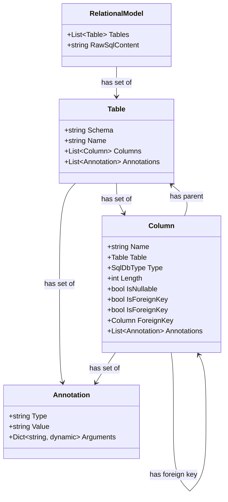
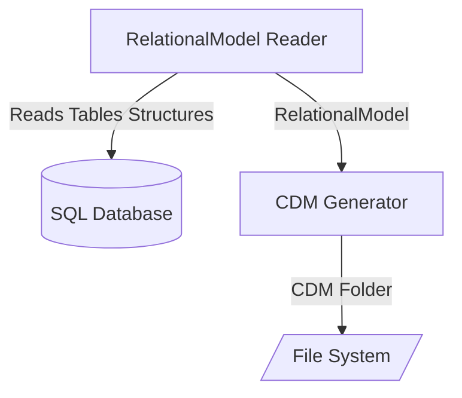
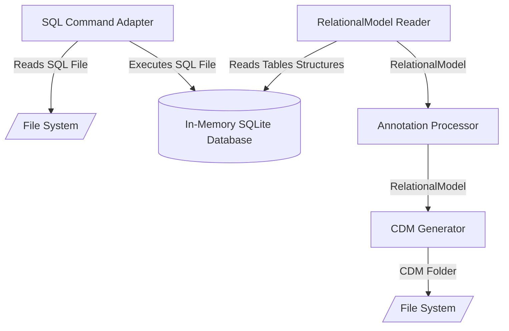

# Implementation Diagrams

## Models

```mermaid
 classDiagram
    RelationalModel --> Table : has set of
    RelationalModel : +List~Table~ Tables
    RelationalModel : +string RawSqlContent

    Table --> Column : has set of
    Table --> Annotation : has set of
    Table : +string Schema
    Table : +string Name
    Table : +List~Column~ Columns
    Table : +List~Annotation~ Annotations

    Column --> Annotation : has set of
    Column --> Table : has parent
    Column --> Column : has foreign key
    Column : +string Name
    Column : +Table Table
    Column : +SqlDbType Type
    Column : +int Length
    Column : +bool IsNullable
    Column : +bool IsForeignKey
    Column : +bool IsForeignKey
    Column : +Column ForeignKey
    Column : +List~Annotation~ Annotations

    Annotation : +string Type
    Annotation : +string Value
    Annotation : +Dict~string, dynamic~ Arguments
```

## Commands

### Generate CDM From SQL Database

```mermaid
graph TD
    DB[(SQL Database)]
    RMR[RelationalModel Reader]
    CDMG[CDM Generator]
    OFS[/File System/]

    RMR  --> |Reads Tables Structures| DB
    RMR  --> |RelationalModel| CDMG
    CDMG --> |CDM Folder| OFS
```

### Generate CDM From SQL File

```mermaid
graph TD
    IFS[/File System/]
    SCA[SQL Command Adapter]
    DB[(In-Memory SQLite Database)]
    RMR[RelationalModel Reader]
    AP[Annotation Processor]
    CDMG[CDM Generator]
    OFS[/File System/]

    SCA  --> |Reads SQL File| IFS
    SCA  --> |Executes SQL File| DB

    RMR  --> |Reads Tables Structures| DB
    RMR  --> |RelationalModel| AP
    AP --> |RelationalModel| CDMG
    CDMG --> |CDM Folder| OFS
```
