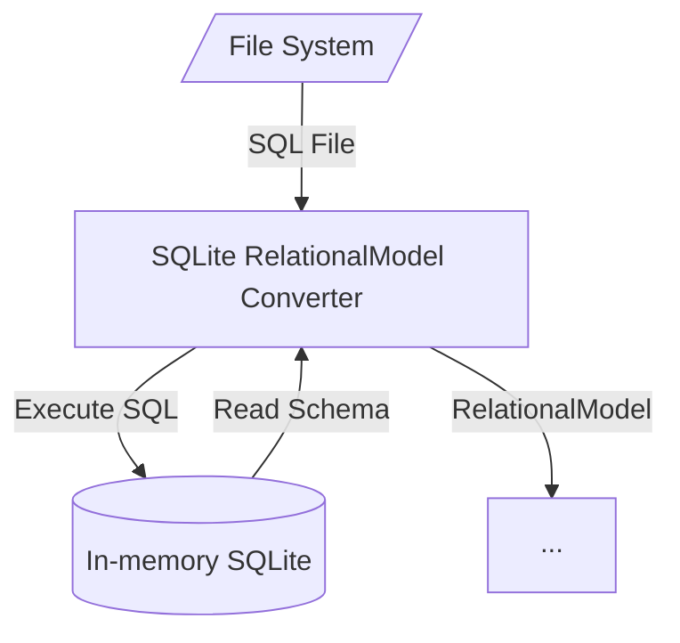

# SQLite Relational Model Reader

`sql2cdm` relies on the in-memory implementation of SQLite to execute the SQL input and then query SQLite system views to retrieve information about tables, columns and relationships. This document explains the queries used during that process.

## PRAGMA Statements

The [PRAGMA statement](https://www.sqlite.org/pragma.html) is an SQL extension specific to SQLite and used to modify the operation of the SQLite library or to query the SQLite library for internal (non-table) data. The PRAGMA statement is issued using the same interface as other SQLite commands (e.g. CREATE, SELECT, INSERT).

## Exploring PRAGMA

Let's explore some PRAGMA statements with a concrete example.

> You can either use [SQLite CLI](https://www.sqlite.org/download.html) or a UI (such as [DB Browser for SQLite](https://sqlitebrowser.org/))

First, try running the following SQL code and create both `Customer` and `CustomerAddresses` on a SQLite database:

```sql
CREATE TABLE Customer
(
	CUSTOMER_ID INT IDENTITY(1,1) PRIMARY KEY,
	CUSTOMER_NAME VARCHAR(50) NOT NULL
);

CREATE TABLE CustomerAddresses
(
	CUSTOMER_ADDRESS_ID INT IDENTITY(1,1) PRIMARY KEY,
	CUSTOMER_ID INT NOT NULL,
	LINE VARCHAR(100) NOT NULL,
	FOREIGN KEY(CUSTOMER_ID) REFERENCES Customer(CUSTOMER_ID)
);
```

### List Tables

Now you can list all tables using the following SQL query:

```sql
SELECT type, name, sql
FROM sqlite_master 
WHERE type ='table' AND name NOT LIKE 'sqlite_%';
```

This gives you the following output:

| **type** | **name**          | **sql**                           |
|----------|-------------------|-----------------------------------|
| table    | Customer          | CREATE TABLE Customer...          |
| table    | CustomerAddresses | CREATE TABLE CustomerAddresses... |

### Get Table Information

For each table you can use [PRAGMA `table_info`](https://www.sqlite.org/pragma.html#pragma_table_info) to retrieve column level information. For instance, querying `CustomerAddresses` table:

```sql
PRAGMA table_info('CustomerAddresses')
```

This gives you the following output:

| **cid** | **name**            | **type**          | **notnull** | **dflt_value** | **pk** |
|---------|---------------------|-------------------|-------------|----------------|--------|
| 0       | CUSTOMER_ADDRESS_ID | INT IDENTITY(1,1) | 0           |                | 1      |
| 1       | CUSTOMER_ID         | INT               | 1           |                | 0      |
| 2       | LINE                | VARCHAR(100)      | 1           |                | 0      |

> Note: `dflt_value` stands for *default value* and `pk` for *primary key*.

### Get Foreign Keys

For each table you can use [PRAGMA `foreign_key_list`](https://www.sqlite.org/pragma.html#pragma_foreign_key_list) to retrieve foreign key constraints created by a REFERENCES clause. For instance, querying `CustomerAddresses` table:

```sql
PRAGMA foreign_key_list('CustomerAddresses')
```

This gives you the following output:

| **id** | **seq** | **table** | **from**    | **to**      | **on_update** | **on_delete** | **match** |
|--------|---------|-----------|-------------|-------------|---------------|---------------|-----------|
| 0      | 0       | Customer  | CUSTOMER_ID | CUSTOMER_ID | NO ACTION     | NO ACTION     | NONE      |

## Implementation Notes

This series of queries is pretty much all the code from [`SqliteRelationalModelReader.cs`](..\..\src\Sql2Cdm.Library\Sql\Sqlite\SqliteRelationalModelReader.cs) and how it builds a `RelationalModel` representation.

The class executes all input SQL statements on the in-memory SQLite and then use SQLite system views and PRAGMAs to retrieve model information. Not only it helped us move fast (by not write a full SQL tokenizer/lexer/parser), but it also gives the user a nice SQL syntax checker (when there's an error on SQL input, SQLite point exactly where the error is).

Here's a diagram of this flow:


